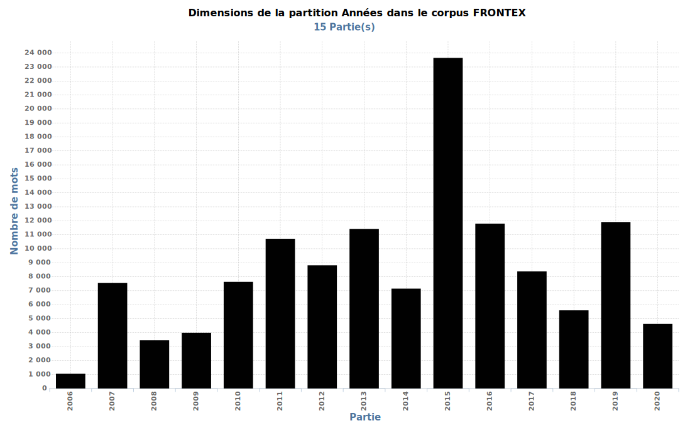
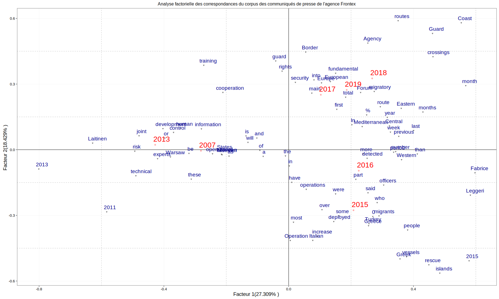
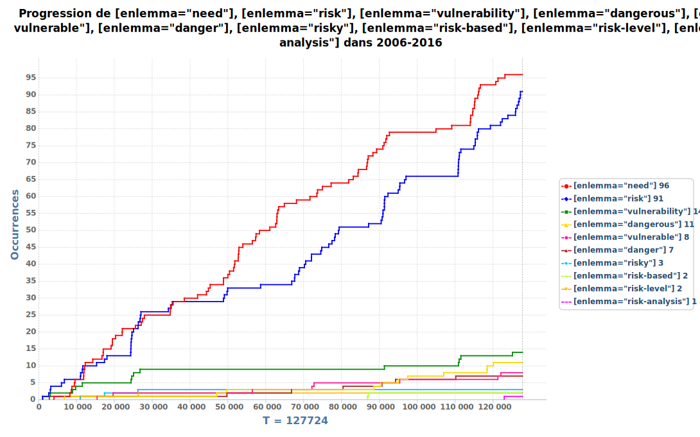

[^16]: Dossier rendu dans le cadre de la formation en textométrie proposée par M. Léo Dumont au sein du parcours histoire, sciences nuumériques et quantitatives de l'École d'Histoire de la Sorbonne.

# Introduction

Frontex est une agence de l'Union européenne, initiallement chargée de la gestion de la coopération opérationnelle aux frontières extérieures des États membres de 2004 et 2016 et transformée depuis lors en Agence européenne de garde-frontières et de garde-côtes. Présentée comme un appui technique aux politiques nationales, cette agence - régulièrement critiquée pour son opacité[@loubiere_frontex_2013] - a vu son discours public particulièrement scrupté lors de ce qui a été qualifié de crise migratoire en Europe en 2015. Cet argumentaire officiel a fait l'objet d'une riche étude par Cécile Dubernet, pour qui "à la question « Qui est vulnérable ? » Frontex semble répondre : les États européens via leurs frontières extérieures"[@dubernet_qui_2018, p. 219]. À l'appui de cette thèse se trouve le dépouillement manuel des communiqués de presse et des documents annexes produits par l'agence Frontex, analyse lexicométrique manuelle présentée par la chercheuse comme un moyen nécessaire pour se prémunir de l'ambiguïté du lexique de la vulnérabilité[@dubernet_qui_2018, p. 212]. Sans prétendre saisir par les outils informatiques l'ensemble des éléments d'administration de la preuve avancés par Cécile Dubernet dans son analyse critique, nous confrontons tout d'abord cette pratique manuelle de la lexicométrie aux méthodes automatisées de la textométrie[@poudat_explorer_2017, p. 25-25] avant de caractériser par ces outils informatiques l'évolution temporelle du discours public de cette institution. 

# Méthodologie

## Constitution du corpus 

Ce corpus est constitué de l'ensemble des communiqués de presse de l'agence Frontex, disponible à l'adresse <https://frontex.europa.eu/media-centre/news-release/>. Si cette littérature - uniquement disponible en langue anglaise - n'épuise pas toutes les publications officielles de cette administration, comme ses rapports annuels ou les discours de ses représentants par exemple, ceux-ci représentent toutefois un objet privilégié d'analyse par l'écho qu'ils connaissent et par la fréquence de leur parution[@dubernet_qui_2018, p. 208]. Bien que ne représentant qu'une partie des documents étudiés par Cécile Duberne, les communiqués de presse ont l'avantage d'être publiés de manière normalisée, ce qui facilite la constitution d'un corpus ayant vocation à être soumis à des outils informatiques.

D'un point de vue technique, la constitution de ce corpus se fait en trois étapes : 1° les métadonnées (titre, date et lien) des communiqués de presse sont obtenues ; 2° l'ensemble des textes des communiqués de presse est récupéré ; 3° un corpus est constitué à l'aide du logiciel TXM. L'ensemble de ces éléments est disponible sur le dépot GitHub <https://github.com/j-rostand/frontex> :

1. Les métadonnées des communiqués de presse, lien, titre[^2] et date, sont récupérées à l'aide du script Python `frontex-metadata.py`[^4]. Elles sont enregistrées dans le fichier `metadata.csv` au sein du dossier `FRONTEX. 
2. Les textes des communiqués de presse sont récupérés à l'aide du script Python `frontex-corpus.py`. Ces textes sont enregistrés dans des fichier `.txt` au sein du dossier `FRONTEX` et prennent comme nom leurs URLs. 
3. Le corpus est constitué à l'aide du logiciel TXM[@heiden_txm_2010] à partir du fichier de métadonnées et de l'ensemble des fichiers textes récupérées en suivant la méthodologie proposée par Eva Schaeffer-Lacroix[@schaeffer-lacroix_preparer_2018]. Annoté par TreeTagger en anglais, ce corpus est enregistré en format binaire sous le nom de `FRONTEX.txm`.

## Analyse du corpus

L'analyse de ce corpus cherche d'une part à étudier par des moyens automatisés la thèse de Cécile Dubernet sur la mise en avant par Frontex de la vulnérabilité des États-membres au détriment de celle des réfugiés et, d'autre part, à rendre compte l'évolution temporelle du discours public de l'agence. 

### Étude de la vulnérabilité dans le discours public

La thèse de Cécile Dubernet repose sur l'étude lexicométrioque "d’une série de mots-clés appartenant au champ lexical de la vulnérabilité et de leurs collocations"[@dubernet_qui_2018, p. 211]. En ce sens, celle-ci développe une analyse en trois niveaux distincts[@dubernet_qui_2018, p. 211-212] :

1. Les racines *vulnerab*, *fragil*, *frail*, *risk*; le terme *danger* et *need* ainsi que les expressions *at risk* et *in need of* visent à identifier la vulnérabilité au sens strict.
2. Les termes *victime*, *crime*, *choice* et *action* sont étudiés à part afin de rendre compte de l'impact de ces termes dans un environnement institutionnel.
3. Les termes *care*, *protection*, *rescue*, *humanitarian* sont enfin retenus pour évaluer le discours relatif aux secouristes.

La période d'étude de Cécile Dubernet, 2006-2016, est reprise en créant un sous-corpus intitulé `2006-2016` dans TXM à l'aide de l'expression suivante : 

`/region[text,a]:: a.text_date="2006.*" | a.text_date="2007.*" | a.text_date="2008.*" | a.text_date="2009.*" | a.text_date="2010.*" | a.text_date="2011.*" | a.text_date="2012.*" | a.text_date="2013.*" | a.text_date="2014.*" | a.text_date="2015.*" | a.text_date="2016.*"`
 
Au sein de ce corpus, les lemmes obtenus à l'aide de TreeTagger seront utilisés afin d'identifier les concordances, les coocurences et la progression de ces diverses formes[^1]. 

### Étude de l'évolution temporelle du discours public

L'étude de l'évolution temporelle du discours public de Frontex s'effectue par une analyse factorielle des correspondances complétée par une classification ascendante hiérarchique à partir d'une partition annuelle du corpus. Cette partition `Années` est obtenue à l'aide du modèle d'expression suivant (ici, pour l'année 2006) : `/region[text,a]:: a.text_date="2006.*"`. À partir de cette partition, une table lexicale contenant des lemmes ayant une fréquence minimale de 2 est obtenue. Celle-ci est exportée en format `csv` et nettoyée dans LibreOffice ; les signes de ponctuation y sont retirés et elle est enregistrée sous le nom de `frontex-table-lexicale-annees.csv` avant d'être téléchargée sur [AnalyseSHS](http://analyse.univ-paris1.fr/), dont les résultats sont disponibles au sein du dossier `AnalyseSHS`.

# Résultats

## La vulnérabilté dans le discours public (2006-2016)

Le sous-corpus `2006-2016` comporte 332 communiqués de presse publiés à 301 dates différentes et pour lesquels 329 titres sont identifés. Les trois thèmes de l'analyse du discours de Cécile Dubernet sont repris ici : 1° la vulnérabilité au sens strict du terme ; 2° la qualification de la victime ; 3° l'action humanitaire. 

### La vulnérabilité au sens strict du terme

La requête `vulnerab.*|fragil.*|frail.*|danger.*|risk.*|need.*` sur les lemmes du corpus `2006-2016` donne le lexique en [@tbl:tbl1] : 

enlemma|Fréquence
--|--
need|96
risk|81
vulnerability|12
dangerous|11
vulnerable|8
danger|7
risky|3
risk-based|2
risk-level|2
risk-analysis|1
: Lexique de la vulnérabilité {#tbl:tbl1}

La progression de l'utilisation de ces lemmes du lexique de la vulnérabilité représentée en [@fig:fig1] permet de rendre compte d'une dichotomie entre les lemmes *need* et *risk* et les autres. Si ces deux lemmes voient leurs occurences augmenter avec la taille du corpus `2006-2016, les lemmes *vulnerability*, *vulnerable*, *danger* et *dangerous* ne sont utilisés en revanche qu'à de rares occasions.

Les dix premiers lemmes signifiants coocurents de ce lexique sont représentés en [@tbl:tbl2]. 

Coocurent | Fréquence | CoFréquence | Indice | Distance moyenne
--|--|--|--|--
analysis | 53 | 37 | 38 | 0,5
assessment | 29 | 18 | 17 | 0,9
identity | 17 | 10 | 9 | 6,2
vulnerabilities | 9 | 7 | 8 | 1,4
tactical | 5 | 5 | 6 | 3,2
fraud | 20 | 8 | 6 | 5,2
document | 46 | 11 | 5 | 5,1
countering | 4 | 4 | 5 | 6,5
challenges | 41 | 10 | 5 | 4,4
operational | 166 | 21 | 5 | 3,1
: Coocurences du lexique de la vulnérabilité {#tbl:tbl2}

L'ensemble de ces lemmes renvoient à l'univers de la maîtrise (*analysis*, *assesment*) par des moyens concrets (*tactical*, *operational*) de la vulnérabilité (*vulnerabilities*) face, comme le révèle un détour par les table de concordances, au phénomène de la migration illégale (*fraud*, *identity*, *document*). Il faut attendre le 17e lemme signifiant, *protection* (indice = 3), pour trouver un lexique évoquant la vulnérabilité des réfugiés eux-mêmes, avec des expressions comme *need of protection*. Ainsi, si le lexique de la vulnérabilité des réfugiés est bien présent dans le discours public de Frontex - avec *lives* (indice = 2) et des expressions comme *lives at risk* et *danger of loss of human lives* par exemple, il ne l'est qu'à des niveaux mineurs.

Une étude plus fine du terme même de la vulnérabilité permet de faire voir,  à l'aide de la requête `[enlemma="vulnerability|vulnerable"]`, une utilisation quasi-exclusive de ces deux termes avant 2015 (18 sur 20 occurences). Elle permet également de faire voir une utilisation différenciée de ces deux termes : là où *migrants*, *persons*, *groups* et *minors* sont *vulnerable*, ce sont les *systems*, les *authorities* qui font face à des *vulnerabilities*. Si le discours mettant l'accent sur les personnes vulnérables est antérieur à celui évoquant la fragilité des autorités, tout deux sont largement circonscrits dans le temps ; ainsi, les communiqués de presse évoquent ces personnes vulnérables de 2009 à 2010, tandis que la fragilité des autorités n'est mise en avant quasi-exclusivement qu'au cours de l'année 2013.

### La qualification de la victime

La requête `victim.*|crime.*|choice.*|action.*` sur les lemmes du corpus `2006-2016` donne le lexique en [@tbl:tbl3] : 

enlemma|Fréquence
--|--
crime|49
victim|29
action|23
actionable|2
choice|2
victimes|1
: Lexique de la qualification de la victime {#tbl:tbl3}

Les dix premiers lemmes signifiants coocurents de cette requête[^8] sont représentés en [@tbl:tbl4]. 

Coocurent | Fréquence | CoFréquence | Indice | Distance moyenne
--|--|--|--|--
trafficking | 62 | 25 | 25 | 4,2
cross-border | 22 | 13 | 16 | 0,4
organised | 37 | 14 | 14 | 0,7
smuggling |  59 | 15 | 12 | 6,1
human | 71 | 16 | 12 | 5,3
beings | 28 | 11 | 11 | 5,9
against | 32 | 11 | 10 | 2,5
forms | 13 | 7 | 8 | 2,4
fight | 22 | 8 | 8 | 3,8
serious | 13 | 6 | 7 | 1,2
: Coocurences du lexique de la qualification de la victime {#tbl:tbl4}

Dans le discours public de Frontex, la victimes identifiée est très clairement le groupe générique des *human* *beings* - et non pas un *migrant* ou des *families* (indices de 3) - impuissant face au *smuggling* et au *trafficking*, prisonniers d'un système (*organised*) contre lequel Frontex combat (*fight* *against*). Les victimes ne sont pour autant pas nommées ainsi de façon constante : la requête `[enlemma="victim"]` permet de mettre à jour l'évolution du discours public de Frontex sur ce sujet sensible : ce terme n'a été employé qu'à 7 reprises (soit moins d'un quart des occurences) entre 2015 et 2016, moment critique s'il en est. Le lemme *crime* `[enlemma="crime"]` est lui identifié dans le discours public de Frontex de manière bien plus importante sur cette période : 23 occurences (soit près de 50%) datent de 2015-2016. Cette évolution temporelle est similaire à celle du lemme *action*, [enlemma="action"]`, qui compte près de la moitié de ses occurences en 2015-2016. Il semble ici que l'agence passe dans son discours d'un accent mis sur la simple identification de victimes, ici du trafic d'êtres humain (*THB*, *trafic of human beings*), à une attention sur ses propres actions menées contre ces traficants. 

### L'action humanitaire

La requête `care.*|protection.*|rescue.*|humanitarian.*` sur les lemmes donne le lexique[^5] en [@tbl:tbl5]. 

enlemma|Fréquence
--|--
rescue|123
protection|36
humanitarian|5
care|3
carefully|2
rescuer|2
protection-sensitive|1
: Lexique de la qualification de l'action humanitaire {#tbl:tbl5}

Les dix premiers lemmes signifiants coocurents de cette requête[^6] sont représentés en [@tbl:tbl6]. 

Coocurent | Fréquence | CoFréquence | Indice | Distance moyenne
--|--|--|--|--
search | 37 | 29 | 36 | 1,7
migrants | 492 | 60 | 18 | 3,3
operations | 164 | 30 | 14 | 0,7
international | 80 | 21 | 13 | 1,0
SAR | 11 | 8 | 9 |  3,5
Triton | 61 | 14 | 8 | 6,0
Libyan | 25 | 9 | 7 | 4,7
weekend | 13 | 7 | 7 | 3,7
off | 20 | 8 | 7 | 3,6
people | 141 | 18 | 6 | 3,8
: Coocurences du lexique de la qualification de l'action humanitaire {#tbl:tbl6}

Ce lexique de l'action humanitaire met fortement en avant la thématique du sauvetage. Le lemme *rescue* est ainsi largement dominant (123 occurences), tandis que les cooccurences renvoient aux *operations* et au *SAR* (*search and rescue*). Si l'agence Frontex n'est pas citée directement, c'est qu'elle agit à travers une mission, *Triton* au large des côtes lybiennes (*Lybian*). Pourtant, si la plupart des opérations ont lieux dans les eaux internationales, cette caractéristique n'est évoquée qu'à la marge[^7] : en effet, c'est à l'*international protection* qu'il est fait référence ici. Si  *protection* et *rescue* sont les deux lemmes les plus largement employés, ceux-ci font l'objet d'un usage différencié : en effet, là où *protection* est employé tout au long du corpus (22 fois avant 2015, soit près de 60% des occurences), celui de *rescue* n'est employé qu'à partir de 2015 (117 fois, soit près de 90% des occurences). On assiste ici à un changement dans le discours public de l'agence, qui passe d'une rhétorique de l'accès à la protection internationale à celle de la mise en avant du sauvetage des *migrants* par ses moyens opérationnels.

## L'évolution temporelle de la structure générale du discours public (2006-2020)

La partition `Années est marqué par une certaine hétérogénéité entre les années. L'année 2015 reprèsente ainsi à elle seule plus de 23 000 mots inscrits dans les communiqués de presse tandis que ceux datés de 2014 n'en comptent que 7 000. Par ailleurs, le début et la fin de notre période d'étude sont marqués par une faible contribution : les communiqués de presse de l'année 2006 ne comptent guère plus de 1 000 mots, tandis qu'en 2020 - année en cours - ceux-ci se limitent au total à près de 3 500 mots. Les dimensions de cette partition sont résumées en [@fig:fig2].

{#fig:fig2}

Les dix premiers lemmes signifiants[^9] de cette partition sont en [@tbl:tbl7].

|enlemma|Fréquence|
|--|--|
|border|1713|
|Frontex|1407|
|European|656|
|EU|655|
|migrant|650|
|operation|525|
|number|446|
|Member|375|
|year|372|
|States|356|
: Lexique de la partition Années {#tbl:tbl7}

L'analyse factorielle des correspondances[^14] effectuée à partir de la table lexicale de cette partition, nettoyée des signes de ponctuation, est significative avec une probabilité d'indépendance de 0[^10]. Comme l'indique la description des facteurs, ceux-ci sont bien décroissants[^11] avec un pourcentage cumulé de 45,74 pour les deux premiers axes[^12]. Avec un seuil de contribution moyen en colonne et en ligne (6.25 et 0.5 respectivement), on obtient la [@fig:fig3] pour les axes 1 et 2.

{#fig:fig3}

On observe une opposition sur l'axe 1 entre les années antérieures à 2015 (à gauche) et les années postérieures à 2015 (à droite)[^13]. Cette opposition temporelle semble correspondre à un lexique technique (*technical*, *information*, *experts*) lié à l'activité d'une administration (*Warwaw*, siège de l'agence, *joint* compte-tenu des nombreux partenaires d'une telle agence) antérieur à la crise de 2015 d'une part (à gauche) et, d'autre part (à droite), à un lexique opérationnel (*detected*, *%*, *more*) lié à l'activité d'un organe responsable de la mise en oeuvre d'une politique (*Fabrice Leggeri*, le directeur) de contrôle (*Western*, *Esatern*, *Mediterranean*) des flux migratoires (*migratory*, *route*). Sur l'axe 2, il se dégage une opposition entre le lexique des années 2015 et 2016 d'une part (en bas) et de 2017 à aujourd'hui d'autre part (en haut). Cette opposition temporelle semble correspondre à un lexique d'action humanitaire (*rescue*, *operation*, *vessels*) déployé au coeur de la crise par l'agence auquel se substitue un lexique de légitimité politique (*Coast* *Guard*, suite au changement de dénomination de Frontex, et une *Border* bien identifiée face aux *crossings*) et morale (*fundamental*, *rights*, *security*). En quelque sorte, il émerge de cette analyse une triple polarité entre un discours technique en retrait de 2006 à 2015, un discours opérationnel d'action humanitaire au coeur de la crise et un discours de légitimité de garde-frontières à partir de 2016.

Cette triple polarité est précisée par la classification ascendante hiérarchique[^15] présentée en [@fig:fig4] et [@fig:fig5]. Si celle-ci identifie nettement le changement de discours opéré entre la période 2015-2016 et la période 2016-2020, elle permet également de mettre en nuancer le discours technique antérieur à 2015. Il semble en effet que ce discours technique soit une spécificité de l'année 2013, période où Frontex fut particulièrement critiquée, et qu'il se distingue du discours de Frontex sur la période 2006-2014. Face à la crise, le discours public de l'agence semble ainsi avoir drastiquement évolué, en passant d'une position technique en retrait (2013) à une position opérationelle affichée (2015). En ce sens, la classification ascendante hiérarchique, confirmant la césure que représente 2015-2016 dans le discours public de l'agence, met à jour la différence profonde dans la communication autour de la crise entre 2013 et 2015.

"){#fig:fig4}

"){#fig:fig5}

# Discussion

## L'approche textométrique confirme la thèse d'un discours public centré sur la vulnérabilité des frontières

Dans l'ensemble, l'approche textométrique confirme la thèse de Cécile Dubernet d'un discours public centré sur la vulnérabilité des frontières. Si la chercheuse mettait en avant "l’intérêt d’une lecture humaine des textes plutôt qu’une revue automatisée des collocations"[@dubernet_qui_2018, p. 212], il nous semble en revanche que l'approche textométrique est en mesure de rendre avec finesse, sur chacun des trois points de l'analyse, les résultats obtenus par une méthode lexicométrique manuelle. 

Premièrement, le discours public de Frontex met bien en avant, comme l'a identifiée par Cécile Duubernet[@dubernet_qui_2018, p. 213-214], la vulnérabilité des frontières au sens strict du terme. Face à cette fragilité des frontières, l'agence européenne annonce en effet prendre en charge la situation, grâce à ses *analysis* et ses *assessment* permettant d'y répondre concrètement (*tactical*, *operational*). L'approche automatisée nous a toutefois permis de préciser cette thèse, en repérant une distinction dans l'usage de *vulnerable* et de *vulnerabilities* entre évocation des expériences des réfugiés (*migrants*, *persons* et *minors*) d'une part et description des besoins des autorités (*authorities*) d'autre part. En revanche, les résultats de notre analyse ne concordent que partiellement avec la description de l'évolution temporelle de l'utilisation de ce lexique. Si la remarque d'une absence (quasi-absence dans notre cas) de l'utilisation de la racine *vulnerab* en 2015 est partagée, notre approche textométrique a également permis d'identifier les périodes d'usage phares de ces deux termes : 2009-2010 pour les personnes décrites comme *vulnerable*, 2013 pour les autorités faisant face à des *vulnerabilities*.

En second lieu, l'étude automatisée développée ici confirme également l'analyse du discours déployé sur les victimes[@dubernet_qui_2018, p. 214]. Le terme de *trafficking* est en effet principalement employé aux côtés de *victim*, et c'est bien la lutte contre le crime du trafic d'être humain (*trafic of human beings*) qui fait le coeur du discours public de Frontex. L'approche développée ici a toutefois pu apporter une précision concernant la chronologie de ce discours : l'agence passe à partir de 2015 d'un accent mis sur l'identification de victimes à une mise en avant de ses propres actions menées contre les traficants.

Enfin, conformément à la thèse de Cécile Dubernet[@dubernet_qui_2018, p. 215], l'étude de l'action humanitaire met à jour l'importance du sauvetage dans le discours public de Frontex. Employé quasi-exclusivement en 2015, cette notion masque la faible considération de Frontex pour les personnes concernées, jusqu'alors encouragées à se tourner vers une *international protection* : passant sous silence les organisations privées, publiques et militaires impliquées dans le sauvetage, Frontex cherche, en 2015, à se faire passer pour le champion de l'action humanitaire.

## Les reconfigurations du discours public de Frontex face à la crise

L'étude textométrique a permis de dégager l'évolution temporelle du discours public de l'agence Frontex. Cette évolution temporelle est marquée par la césure que représente la crise migratoire de 2015. Face a ce phénomène, l'agence a réinventé son discours public pour se poser en acteur unique de l'action humanitaire, en prenant à revers la posture technique qu'elle avait développée en 2013 pour laquelle elle avait été critiquée[@loubiere_frontex_2013]. L'obtention de légitimité politique que marque la transformation de l'agence en *European Border and Coast Guard Agency* se retrouve dans son discours public, qui prétend à la légitimité morale en invoquant les *fundamental rights* tout en assumant la clôture de la frontière.

# Conclusion

L'étude automatisée du corpus des communiqués de presse de Frontex a permis de confirmer et d'apporter des précisions à la thèse défendue par Cécile Dubernet selon laquelle le discours public de Frontex se caractérise par la mise en avant de la vulnérabilité des frontières plutôt que celle des réfugiés. Si cette méthode ne remplace pas le fin exercice d'analyse de l'iconographie, des images et des cartes effectué[^3], rien ne semble justifier l'assertion qu'une "lecture humaine" serait plus appropriée qu'une "revue automatisée" pour dégager du sens de ce corpus des communiqués de presse. Au-delà de cette querelle de doctrine au regard des méthodes numériques, la "lecture automatisée" effectuée ici sur l'ensemble du corpus a permis de mettre à jour les reconfigurations du discours public de l'agence Frontex face à la crise ; résultat qu'il conviendrait, à l'avenir, de confronter, par l'approche mutlidimensionnelle adoptée par Cécile Dubernet dans son article mais également par l'approche textométrique développée ici, aux évolutions du discours public des critiques de cette politique migratoire à laquelle participe Frontex. 

# Annexe

{#fig:fig1}

| Nom | Bibliothèques | Objet |
|:---|---|---|
| `frontex-metadata.py` | `requests`, `BeautifulSoup`, `pandas`, `csv` | Récupération des métadonnées de l'ensemble des communiqués de presse de l'agence Frontex |
| `frontex-corpus.py` | `requests`, `BeautifulSoup`, `pandas` | Récupération des textes des communiqués de presse de l'agence Frontex |
| `AFC.R` | `gridExtra`, `FactoMineR`, `ggplot2`, `XML` | Analyse factorielles des correspondances proposée par AnalyseSHS |
| `CAH.R` | `cluster`, `JLutils`, `RSVGTipsDevice`, `FactoMineR` | Classification acsendate hiérarchique proposée par AnalyseSHS |
: Scripts et bibliothèques employés

# Références

[^1]: En conséquence, les expressions *at risk* et *in need of* ne seront pas étudiées en tant que telles mais à travers les termes *risk* et *need*.

[^2]: Compte tenu de la briéveté des communiqués et de leur propension à reprendre la formulation du titre dans le corps du texte, ceux-ci sont considérés au cours de l'analyse comme des métadonnées et non comme une partie du texte. Il est toutefois parfaitement envisageable de suivre la stratégie opposée. 

[^5]: Le lemme *career* (4 occurences) est écarté de l'analyse.

[^6]: `[enlemma="rescue|protection|humanitarian|care|carefully|rescuer|protection-sensitive"]`.

[^7]: Trois fois d'après la table des concordances : le 16 février dans le communiqué *Assets deployed in operation Triton involved in saving 3,000 migrants since Friday*, le 21 février 2015, dans le communiqué *Joint Operation Triton extended to the end of 2015 the operation* et le 15 novembre 2016, dans le communiqué *FRAN Quarterly: Illegal border-crossings drop by more than half in Q2 2016*. 

[^8]: `[enlemma="crime|victim|action|actionable|choice|victimes"]`.

[^9]: Les lemmes suivants ont été écartés (par ordre de fréquence, séparés par une virgule) : *the*, *,*, *of*, *.*, *and*, *in*, *to*, *be*, *a*, *on*, *for*, *with*, *by*, *at*, *as*, *from*, *"*, *(*, *)*, *will*, *this* et *have*. Le lemme *border* a été fusionné avec *Border*. Voir le fichier `frontex-annees-lemmes.csv` dans le dossier `TXM` pour la fréquence de ces termes année par année. 

[^10]: Voir le fichier `chi2.csv`.

[^11]: Voir le fichier `description_des_facteurs.svg`.

[^12]: Voir le fichier `tab_facteurs.csv`.

[^13]: Voir également le fichier `AFC_1et_2_au_Seuil_de_contribution_00.svg`.

[^14]: Voir le script `AFC.R` obtenu sur AnalyseSHS.

[^15]: Voir le script `CAH.R` obtenu sur AnalyseSHS.

[^3]: [@dubernet_qui_2018, p. 218-219].

[^4]: L'ensemble des scripts Python et R est disponible au sein du dossier `scripts`.
